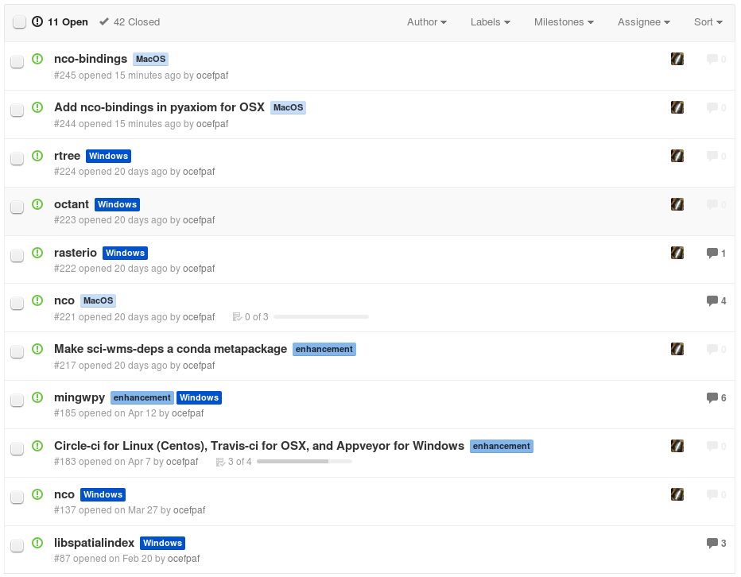

% Conda: A love and hate story

---

# Who am I?


> - (or Filipe Fernandes)

# The problem

- Integrated Ocean Observing System (IOOS) likes python,
- but, but...


- ... how to get hundreds of scientist using different platforms, and a myriad of configurations to reproduce their results?

> Or just to **get it** running!!!

# Can conda do it?

> - I like to think I am a dedicated "sysadmin."
> - Maybe almost like this guy 
> - So when my boss told me to consider conda I promptly answer:
> - **NO!**
> - We need stable tools like `pip` and `virtualenv`
> - Build a binary in your local machine?  Upload it?  Someone else will install that thing?  **NO WAY!!!**

# The IOOS ~~Binstar~~ Anaconda Channel

> - 107 packages active packages.  (Some made it into the default channel and were deprecated along the way.)
> - Linux, Windows and OSX
> - Some really hard to compile like `iris`, `nco` and `gridgen`...
> - ...are now available via just `conda install -c ioos iris`


# How we use it?

```bash

conda config --add channels ioos

wget http://bit.ly/ioos_req -O ioos_req.txt

conda create --yes -n IOOS --file ioos_req.txt python=2.7

export PATH=$HOME/miniconda/bin:$PATH && source activate IOOS
```

. . .

That is it!


# Downloads


# Packages per OS

## Linux and OSX: 107
## Windows: 90

# How we do it?

> - Conda recipes are hosted on GitHub
> - [AppVeyor](http://www.appveyor.com/) &#10139; Windows
> - [Travis-CI](https://travis-ci.org/) &#10139; OSX
> - [Centos docker container](https://registry.hub.docker.com/u/ocefpaf/centos64-conda-obvious-ci/) &#10139; Linux
> - (Or just forget about all that and go to @pelson's talk tomorrow!) 

# PRs


# Issues




# How to contribute?

> - Improve the [Wiki](https://github.com/ioos/conda-recipes/wiki)
> - Report problems in our [Issues page](https://github.com/ioos/conda-recipes/issues)
> - Requests packages
> - Pull Requests are even better ;-)

# Thanks!


### Acknowledgements

*We would like to thank SECOORA for the funding support. We  would also like to thank the contributions of members of NOAA/IOOS, and Principal investigators.*

**Special thanks to SciPy for the financial aid**
